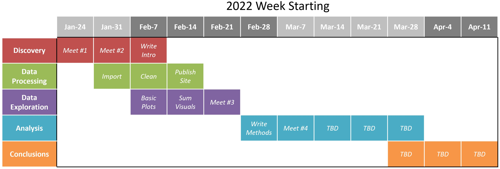
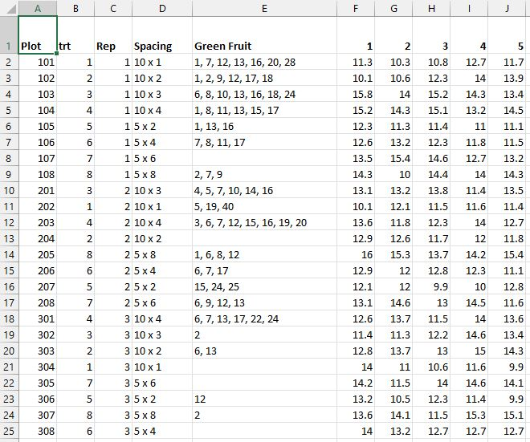

```{r setup, include=FALSE}
library(tidyverse)
library(formatR)
library(dplyr)
library(readxl)
library(ggplot2)
library(writexl)
library(haven)
library(lubridate)
knitr::opts_chunk$set(echo=TRUE,tidy.opts=list(width.cutoff=70),tidy=TRUE)
```

```{r deliveryPhases, echo=FALSE, out.width="130%"}

```

# Discovery  

As a graduate level course offering at North Carolina State University, *ST542 - Statistical Practice* provides a discussion-based introduction to statistical practice that is geared towards students in the final semester of their Master of Statistics degree. Students  practice writing and presenting throughout the semester, gaining soft skills that aren't necessarily covered in other statistical courses. Students are paired and assigned to consulting engagements provided by the instructor that are selected from a list of projects submitted by researchers on campus. Covered topics of the course include negotiating expectations with clients, technical writing and editing, data cleaning and visualization, and finding research ideas from consulting projects.  

## Participants  

**Client:** Kim Heagy *(NCSU Horticulture Grad Student)*  
**Consultants:** Brian Sugg, Chengxi Zou *(NCSU Statistics Grad Students)*  

## Project Background  

Pumpkins are an emerging specialty crop in North Carolina. In 2019 the state produced 713,000 cwt of pumpkins on 3,000 acres, ranking 6th in the United States where overall national production is steadily increasing. With the rise in pumpkin production there is an increasing need for providing clear guidelines to North Carolina farmers on how plant density impacts overall production. In the absence of clear guidelines, North Carolina Extension Agents have noticed a variety of methods in how farmers grow pumpkins. There is a challenge in not only determining how to optimize land usage, but also in how to optimize the capacity of transportation bins for moving pumpkins to market. Another challenge facing farmers is the rise in commodity prices for fertilizer, the primary means for applying nitrogen to crops.  

Taking into consideration these challenges, it has become necessary to provide advice to farmers on how growing conditions affect the yield of pumpkin crops. As part of her thesis for her graduate program at NC State, Kim Heagy has focused her research in two areas on how to grow pumpkins most efficiently:  

1. Researching plant density by conducting a plant spacing study, where the hypothesis is pumpkins grown closer together will have a higher overall yield.  
2. Researching fertilizer application levels by conducting a separate nitrogen study, where the hypothesis is higher leaf nitrogen composition will indicate higher yields.  

The two studies were conducted at the NC State Extension Upper Mountain Research Station under the care of North Carolina Extension Agents.  

## Expectations  

This project will be expected to deliver:  

1. A response to the proposed hyptheses:  
    + *Pumpkins grown closer together will have a higher overall yield.*  
    + *Higher leaf nitrogen composition will indicate higher yields.*  
2. Documentation of how the analysis was conducted  
3. Clean data files and visuals  
4. Pumpkin bin optimization analysis  

Following the below delivery timeline for each phase of work:  

```{r deliveryTimeline, echo=FALSE, out.width="130%"}

```

# Data Processing  

Raw data from the research conducted in 2020 and 2021 was provided in multiple Excel files. An inventory is outlined below of the source files that were received:  

* `2020 Pumpkin Results for Joy.xlsx`  
    + 2020 Spacing Study  
* `2020 stand count.xlsx`  
    + 2020 Spacing Study Stand Counts  
* `2021 Pumpkin Trial Data.xlsx`  
    + 2021 Spacing Study  
    + 2021 Nitrogen Study  
    + 2021 Leaf Composition Study  
* `2021 Bin Pumpkin Sizes.xlsx`  
    + 2021 Bin Capacity Study  

## Data Formatting  

Each of the provided files required formatting in Excel prior to importing into R. A full step-by-step overview of the changes made within each Excel workbook is outlined further below. Generally speaking, the formatting effort focused on getting the worksheets into a table form. This included tasks such as removing unnecessary blank rows and columns, ensuring categorical values were consistently spelled and spaced ("10 x 1" rather than "10x 1"), along with other minor changes to assist with a clean import to R.  

### 2020 Pumpkin Results for Joy.xlsx  

This file contained the 2020 spacing study data, consisting of three worksheets total, with one worksheet for each of the three metrics that were recorded during the harvest (weight, length, diameter). The worksheet inventory included:  

* `Spacing Weight`  
* `Spacing Length`  
* `Spacing Diameter`  

The below formatting steps were followed for each of the three worksheets:  

1. Removed empty rows and empty columns from the top and the left of the main data frame  
    + Resulted in all column names moving up to row 1  
2. Removed empty rows between records that were separating `reps`  
3. Inserted 1 column at column D position as `Spacing` to hold a concatenation of the `Row Distance` and `In Row Distance` columns, to match the same presentation of the `Spacing` variable in the 2021 data  
    + Formula = `CONCATENATE($E2," x ",$F2)` and apply down entire column  
4. Copied the new `Spacing` column D and pasted back as values only to remove formula dependence on `Row Distance` and `In Row Distance`  
5. Deleted the `Row Distance` and `In Row Distance` columns after concatenation  
6. Checked `Green Fruit` column E to ensure all values were evenly spaced by ", " ("comma space") for parsing during the import process  
7. Repeated the above steps 1 - 6 for the other two worksheets  

Finally, the file was renamed to `2020pumpkinData.xlsx` after formatting for easy future reference.  

#### Preview Before Formatting  

```{r dataFormat2020spacingBefore, echo=FALSE, fig.cap="2020 Pumpkin Results for Joy.xlsx", out.width="85%"}
knitr::include_graphics("./Images/Files/2020spacingBefore.JPG")
```

#### Preview After Formatting  

```{r dataFormat2020spacingAfter, echo=FALSE, fig.cap="2020pumpkinData.xlsx", out.width="85%"}

```

### 2020 stand count.xlsx  

This file contained the stand count data from the 2020 spacing study, which was not part of the original file `2020 Pumpkin Results for Joy.xlsx`. The worksheet inventory included:  

* `Sheet1`  

The below formatting steps were followed:  

1. Removed empty rows and empty columns from the top and the left of the main data frame  
    + Resulted in all column names moving up to row 1  

Finally, the file was renamed to `2020standCount.xlsx` after formatting for easy future reference.  

### 2021 Pumpkin Trial Data.xlsx  

This file contained the 2021 spacing study, nitrogen study, and leaf composition study data, consisting of nine worksheets total, with one worksheet for each of the three metrics that were recorded during the harvest (weight, length, diameter) for each of the three studies. The worksheet inventory included:  

* `Spacing Weights (lbs)`  
* `Spacing Lengths (inches)`  
* `Spacing Diameters (inches)`  
* `Nitrogen Weights (lbs)`  
* `Nitrogen Lengths (inches)`  
* `Nitrogen Diameters (inches)`  
* `Leaf Analysis Nitrogen (%)`  
* `Leaf Analysis Phosphorus (%)`  
* `Leaf Analysis Potassium (%)`  

#### Spacing Study  

The below formatting steps were followed for each of the three worksheets for the spacing study:  

1. Removed empty rows and empty columns from the top and the left of the main data frame  
    + Resulted in all column names moving up to row 1  
2. Removed empty rows between records that were separating `reps`  
3. Checked `Spacing` column F to ensure all values were evenly spaced for consistent categorical values  
    + Example: Adjusted `5x 8` to `5 x 8`  
4. Checked `Green Fruit` column G to ensure all values were evenly spaced by ", " ("comma space") for parsing during the import process  
5. Repeated the above steps 1 - 4 for the other two spacing study worksheets  

#### Nitrogen Study  

The below formatting steps were followed for the `Nitrogen Weights (lbs)` worksheet:  

1. Removed empty column A, so the table starts in column A  
2. Removed empty rows between records that were separating `reps`  
3. Checked column B - `Nitrogen Rate` to ensure all values were spaced with 1 space between the number and unit of measure, and no spaces were within the unit of measure  
    + Example: Adjusted `lbs/ acre` to `lbs/acre` for consistency  
4. Renamed worksheet to `Nitrogen Weights (lbs) Orange`  
5. Created a copy of the worksheet, and renamed the  copy as `Nitrogen Weights (lbs) Green`  
6. In the `Nitrogen Weights (lbs) Orange` worksheet:  
    + Deleted columns V through AT to remove all green pumpkin data  
    + Deleted the top row so all column headers move up to row 1  
7. In the `Nitrogen Weights (lbs) Green` worksheet:  
    + Deleted columns G through V to remove all orange pumpkin data  
    + Deleted the top row so all column headers move up to row 1  

The below formatting steps were followed for the `Nitrogen Lengths (inches)` worksheet:  

1. Removed empty column A, so the table starts in column A  
2. Removed empty rows between records that were separating `reps`  
3. Checked column B - `Nitrogen Rate` to ensure all values were spaced with 1 space between the number and unit of measure, no spaces were within the unit of measure, and no extra forward slashes were present  
    + Example: Adjusted `lbs/ acre` to `lbs/acre` for consistency  
    + Example: Adjusted `200 /lbs/acre` to `200 lbs/acre` for consistency  
4. Renamed worksheet to `Nitrogen Lengths (inches) O`  
    + Note: Spelling out "Orange" was too many characters for a worksheet name  
5. Created a copy of the worksheet, and renamed the  copy as `Nitrogen Lengths (inches) G`  
6. In the `Nitrogen Lengths (inches) O` worksheet:  
    + Deleted columns L through P to remove all green pumpkin data  
    + Deleted the top row so all column headers move up to row 1  
7. In the `Nitrogen Lengths (inches) G` worksheet:  
    + Deleted columns G through L to remove all orange pumpkin data  
    + Deleted the top row so all column headers move up to row 1  

The below formatting steps were followed for the `Nitrogen Diameters (inches)` worksheet:  

1. Removed empty column A, so the table starts in column A  
2. Removed empty rows between records that were separating `reps`  
3. Checked column B - `Nitrogen Rate` to ensure all values were spaced with 1 space between the number and unit of measure, and no spaces were within the unit of measure  
    + Example: Adjusted `lbs/ acre` to `lbs/acre` for consistency  
4. Renamed worksheet to `Nitrogen Diameters (inches) O`  
    + Note: Spelling out "Orange" was too many characters for a worksheet name  
5. Created a copy of the worksheet, and renamed the  copy as `Nitrogen Diameters (inches) G`  
6. In the `Nitrogen Diameters (inches) O` worksheet:  
    + Deleted columns L through P to remove all green pumpkin data  
    + Deleted the top row so all column headers move up to row 1  
7. In the `Nitrogen Diameters (inches) G` worksheet:  
    + Deleted columns G through L to remove all orange pumpkin data  
    + Deleted the top row so all column headers move up to row 1  

#### Leaf Composition Study  

The below formatting steps were followed for each of the three worksheets for the leaf composition study:  

1. Removed empty rows and empty columns from the top and the left of the main data frame  
    + Resulted in all column names moving up to row 1  
2. Removed empty rows between records that were separating `reps`  
3. Removed empty column E  
4. Checked `Nitrogen Rate` column B to ensure all values were evenly spaced for consistent categorical values  
    + Example: Adjusted `lbs/ acre` to `lbs/acre` for consistency  
5. Repeated the above steps 1 - 4 for the other two leaf composition study worksheets  

**Note:** The `Nitrogen Rate` value for `Plot` 302 in the `Leaf Analysis Nitrogen (%)` worksheet was blank. Updated to reflect the value of `200 lbs/acre` that was associated with this plot in the `Leaf Analysis Phosphorus (%)` and `Leaf Analysis Potassium (%)` worksheets.  

**Note:** The `Treatment` value for `Plot` 406 in the `Leaf Analysis Nitrogen (%)` worksheet was listed as `4`. Updated to reflect the treatment value of `2` that was associated with this plot in the `Leaf Analysis Phosphorus (%)` and `Leaf Analysis Potassium (%)` worksheets.

Finally, the file was renamed to `2021pumpkinData.xlsx` after formatting for easy future reference.  

#### Preview Before Formatting  

```{r dataFormat2021spacingBefore, echo=FALSE, fig.cap="2021 Pumpkin Trial Data.xlsx", out.width="85%"}
knitr::include_graphics("./Images/Files/2021spacingBefore.JPG")
```

#### Preview After Formatting  

```{r dataFormat2021spacingAfter, echo=FALSE, fig.cap="2021pumpkinData.xlsx", out.width="85%"}
knitr::include_graphics("./Images/Files/2021spacingAfter.JPG")
```

### 2021 Bin Pumpkin Sizes.xlsx  

To be processed...  

## Data Import  

### Spacing Study  

#### 2020 Data  

Check workbook names and worksheet names for each of the 3 read_excel functions.  
Check columns to gather and ensure in Excel the columns with metrics are 6 to 53.  
Adjust both the year and pumpkin ID variables to reflect year 2020.  
Remove or correct data errors/outliers.  

```{r readExcel2020spacing, message=FALSE, cache=TRUE}
# Read sheet with WEIGHTS, transform from wide to tall, remove NA records
spacingWeight <- read_excel(path="./ReadData/2020pumpkinData.xlsx", sheet="Spacing Weight")
spacingWeight <- gather(spacingWeight,key="Pumpkin",value="Weight",6:53)
spacingWeight <- subset(spacingWeight,!is.na(Weight))
# Rename columns
names(spacingWeight) <- c("plot","treatment","rep","spacingDim","greenPumpkins","pumpkinNum","weight")
# Create unique identifier for each pumpkin
spacingWeight <- mutate(spacingWeight,year="2020")
spacingWeight <- mutate(spacingWeight,pumpkinID=paste0(year,"-","S","-",plot,"-",pumpkinNum))

##########################

# Read sheet with LENGTHS, transform from wide to tall, remove NA records
spacingLength <- read_excel(path="./ReadData/2020pumpkinData.xlsx", sheet="Spacing Length")
spacingLength <- gather(spacingLength,key="Pumpkin",value="Length",6:52)
spacingLength <- subset(spacingLength,!is.na(Length))
# Rename columns
names(spacingLength) <- c("plot","treatment","rep","spacingDim","greenPumpkins","pumpkinNum","length")
# Create unique identifier for each pumpkin and assign crop year
spacingLength <- mutate(spacingLength,year="2020")
spacingLength <- mutate(spacingLength,pumpkinID=paste0(year,"-","S","-",plot,"-",pumpkinNum))

##########################

# Read sheet with DIAMETERS, transform from wide to tall, remove NA records
spacingDiameter <- read_excel(path="./ReadData/2020pumpkinData.xlsx", sheet="Spacing Diameter")
spacingDiameter <- gather(spacingDiameter,key="Pumpkin",value="Diameter",6:52)
spacingDiameter <- subset(spacingDiameter,!is.na(Diameter))
# Rename columns
names(spacingDiameter) <- c("plot","treatment","rep","spacingDim","greenPumpkins","pumpkinNum","diameter")
# Create unique identifier for each pumpkin and assign crop year
spacingDiameter <- mutate(spacingDiameter,year="2020")
spacingDiameter <- mutate(spacingDiameter,pumpkinID=paste0(year,"-","S","-",plot,"-",pumpkinNum))

##########################

# Join all spacing metrics in one raw table for quality checks
spacingDataRaw2020 <- inner_join(spacingWeight,spacingLength)
spacingDataRaw2020 <- inner_join(spacingDataRaw2020,spacingDiameter)

# Read sheet with stand count data
spacingStand <- read_excel(path="./ReadData/2020standCount.xlsx", sheet="Sheet1")
# Rename columns
names(spacingStand) <- c("treatment","spacingDim","plot","standCountIdeal","standCount")
# Remove measurement abbreviation for feet (')
spacingStand$spacingDim <- str_remove_all(spacingStand$spacingDim,"'")

# Join stand counts to spacing metrics
spacingDataRaw2020 <- left_join(spacingDataRaw2020,spacingStand)

# Arrange columns for presentation of final table for spacing data
spacingDataRaw2020 <- select(spacingDataRaw2020,c(1,2,3,13,12,4,5,6,7,8,9,10,11))

# Create clean table for further transformations
spacingData2020 <- as_tibble(spacingDataRaw2020)

# Remove or correct errors/outliers that still remain after inner join
# 2020 spacing study, plot 102, delete fruit 28 - no weight data taken since it was rotten
spacingData2020 <- subset(spacingData2020, weight!="rotten")
# 2020 spacing study, plot 201, correct fruit 17 - weight is 33.2 not 3.2
if(sum(spacingData2020$pumpkinID=="2020-S-201-17")==1) {
  w <- which(spacingData2020$pumpkinID=="2020-S-201-17")
  spacingData2020$weight[w] <- "33.2"
} else{
    stop("Weight outlier from 2020 spacing study, plot 201, pumpkin 17 could not be found and corrected.")
  }
```  

#### 2021 Data  

Check workbook names and worksheet names for each of the 3 read_excel functions.  

```{r readExcel2021spacing, message=FALSE, cache=TRUE}
# Read sheet with WEIGHTS, transform from wide to tall, remove NA records
spacingWeight <- read_excel(path="./ReadData/2021pumpkinData.xlsx", sheet="Spacing Weights (lbs)")
spacingWeight <- gather(spacingWeight,key="Pumpkin",value="Weight",8:55)
spacingWeight <- subset(spacingWeight,!is.na(Weight))
# Rename columns
names(spacingWeight) <- c("plot","treatment","rep","standCount","standCountIdeal","spacingDim","greenPumpkins","pumpkinNum","weight")
# Create unique identifier for each pumpkin
spacingWeight <- mutate(spacingWeight,year="2021")
spacingWeight <- mutate(spacingWeight,pumpkinID=paste0(year,"-","S","-",plot,"-",pumpkinNum))

##########################

# Read sheet with LENGTHS, transform from wide to tall, remove NA records
spacingLength <- read_excel(path="./ReadData/2021pumpkinData.xlsx", sheet="Spacing Lengths (inches)")
spacingLength <- gather(spacingLength,key="Pumpkin",value="Length",8:55)
spacingLength <- subset(spacingLength,!is.na(Length))
# Rename columns
names(spacingLength) <- c("plot","treatment","rep","standCount","standCountIdeal","spacingDim","greenPumpkins","pumpkinNum","length")
# Create unique identifier for each pumpkin and assign crop year
spacingLength <- mutate(spacingLength,year="2021")
spacingLength <- mutate(spacingLength,pumpkinID=paste0(year,"-","S","-",plot,"-",pumpkinNum))

##########################

# Read sheet with DIAMETERS, transform from wide to tall, remove NA records
spacingDiameter <- read_excel(path="./ReadData/2021pumpkinData.xlsx", sheet="Spacing Diameters (inches)")
spacingDiameter <- gather(spacingDiameter,key="Pumpkin",value="Diameter",8:55)
spacingDiameter <- subset(spacingDiameter,!is.na(Diameter))
# Rename columns
names(spacingDiameter) <- c("plot","treatment","rep","standCount","standCountIdeal","spacingDim","greenPumpkins","pumpkinNum","diameter")
# Create unique identifier for each pumpkin and assign crop year
spacingDiameter <- mutate(spacingDiameter,year="2021")
spacingDiameter <- mutate(spacingDiameter,pumpkinID=paste0(year,"-","S","-",plot,"-",pumpkinNum))

##########################

# Join all spacing metrics in one raw table for quality checks
spacingDataRaw2021 <- inner_join(spacingWeight,spacingLength)
spacingDataRaw2021 <- inner_join(spacingDataRaw2021,spacingDiameter)

# Create clean table for further transformations
spacingData2021 <- as_tibble(spacingDataRaw2021)
```  

### Nitrogen Study  

#### 2021 Data  

Check workbook names and worksheet names for each of the 3 read_excel functions.  

```{r readExcel2021nitrogen, cache=TRUE}
# Read sheet with WEIGHTS for orange pumpkins, transform from wide to tall, remove NA records
nitrogenWeightOrange <- read_excel(path="./ReadData/2021pumpkinData.xlsx", sheet="Nitrogen Weights (lbs) Orange")
nitrogenWeightOrange <- gather(nitrogenWeightOrange,key="Pumpkin",value="Weight",7:21)
nitrogenWeightOrange <- subset(nitrogenWeightOrange,!is.na(Weight))
# Rename columns
names(nitrogenWeightOrange) <- c("plot","nitrogenRate","treatment","rep","standCount","standCountIdeal","pumpkinNum","weight")
# Create variable for color
nitrogenWeightOrange <- mutate(nitrogenWeightOrange,color="Orange")
# Create unique identifier for each pumpkin
nitrogenWeightOrange <- mutate(nitrogenWeightOrange,year="2021")
nitrogenWeightOrange <- mutate(nitrogenWeightOrange,pumpkinID=paste0(year,"-","N","-",plot,"-",color,"-",pumpkinNum))

# Read sheet with WEIGHTS for green pumpkins, transform from wide to tall, remove NA records
nitrogenWeightGreen <- read_excel(path="./ReadData/2021pumpkinData.xlsx", sheet="Nitrogen Weights (lbs) Green")
nitrogenWeightGreen <- gather(nitrogenWeightGreen,key="Pumpkin",value="Weight",7:30)
nitrogenWeightGreen <- subset(nitrogenWeightGreen,!is.na(Weight))
# Rename columns
names(nitrogenWeightGreen) <- c("plot","nitrogenRate","treatment","rep","standCount","standCountIdeal","pumpkinNum","weight")
# Create variable for color
nitrogenWeightGreen <- mutate(nitrogenWeightGreen,color="Green")
# Create unique identifier for each pumpkin
nitrogenWeightGreen <- mutate(nitrogenWeightGreen,year="2021")
nitrogenWeightGreen <- mutate(nitrogenWeightGreen,pumpkinID=paste0(year,"-","N","-",plot,"-",color,"-",pumpkinNum))

# Combine all weights into one tibble
nitrogenWeight <- rbind(nitrogenWeightOrange,nitrogenWeightGreen)

##########################

# Read sheet with LENGTHS for orange pumpkins, transform from wide to tall, remove NA records
nitrogenLengthOrange <- read_excel(path="./ReadData/2021pumpkinData.xlsx", sheet="Nitrogen Lengths (inches) O")
nitrogenLengthOrange <- gather(nitrogenLengthOrange,key="Pumpkin",value="Length",7:11)
nitrogenLengthOrange <- subset(nitrogenLengthOrange,!is.na(Length))
# Rename columns
names(nitrogenLengthOrange) <- c("plot","nitrogenRate","treatment","rep","standCount","standCountIdeal","pumpkinNum","length")
# Create variable for color
nitrogenLengthOrange <- mutate(nitrogenLengthOrange,color="Orange")
# Create unique identifier for each pumpkin
nitrogenLengthOrange <- mutate(nitrogenLengthOrange,year="2021")
nitrogenLengthOrange <- mutate(nitrogenLengthOrange,pumpkinID=paste0(year,"-","N","-",plot,"-",color,"-",pumpkinNum))

# Read sheet with LENGTHS for green pumpkins, transform from wide to tall, remove NA records
nitrogenLengthGreen <- read_excel(path="./ReadData/2021pumpkinData.xlsx", sheet="Nitrogen Lengths (inches) G")
nitrogenLengthGreen <- gather(nitrogenLengthGreen,key="Pumpkin",value="Length",7:10)
nitrogenLengthGreen <- subset(nitrogenLengthGreen,!is.na(Length))
# Rename columns
names(nitrogenLengthGreen) <- c("plot","nitrogenRate","treatment","rep","standCount","standCountIdeal","pumpkinNum","length")
# Create variable for color
nitrogenLengthGreen <- mutate(nitrogenLengthGreen,color="Green")
# Create unique identifier for each pumpkin
nitrogenLengthGreen <- mutate(nitrogenLengthGreen,year="2021")
nitrogenLengthGreen <- mutate(nitrogenLengthGreen,pumpkinID=paste0(year,"-","N","-",plot,"-",color,"-",pumpkinNum))

# Combine all lengths into one tibble
nitrogenLength <- rbind(nitrogenLengthOrange,nitrogenLengthGreen)

##########################

# Read sheet with DIAMETERS for orange pumpkins, transform from wide to tall, remove NA records
nitrogenDiameterOrange <- read_excel(path="./ReadData/2021pumpkinData.xlsx", sheet="Nitrogen Diameters (inches) O")
nitrogenDiameterOrange <- gather(nitrogenDiameterOrange,key="Pumpkin",value="Diameter",7:11)
nitrogenDiameterOrange <- subset(nitrogenDiameterOrange,!is.na(Diameter))
# Rename columns
names(nitrogenDiameterOrange) <- c("plot","nitrogenRate","treatment","rep","standCount","standCountIdeal","pumpkinNum","diameter")
# Create variable for color
nitrogenDiameterOrange <- mutate(nitrogenDiameterOrange,color="Orange")
# Create unique identifier for each pumpkin
nitrogenDiameterOrange <- mutate(nitrogenDiameterOrange,year="2021")
nitrogenDiameterOrange <- mutate(nitrogenDiameterOrange,pumpkinID=paste0(year,"-","N","-",plot,"-",color,"-",pumpkinNum))

# Read sheet with DIAMETERS for green pumpkins, transform from wide to tall, remove NA records
nitrogenDiameterGreen <- read_excel(path="./ReadData/2021pumpkinData.xlsx", sheet="Nitrogen Diameters (inches) G")
nitrogenDiameterGreen <- gather(nitrogenDiameterGreen,key="Pumpkin",value="Diameter",7:10)
nitrogenDiameterGreen <- subset(nitrogenDiameterGreen,!is.na(Diameter))
# Rename columns
names(nitrogenDiameterGreen) <- c("plot","nitrogenRate","treatment","rep","standCount","standCountIdeal","pumpkinNum","diameter")
# Create variable for color
nitrogenDiameterGreen <- mutate(nitrogenDiameterGreen,color="Green")
# Create unique identifier for each pumpkin
nitrogenDiameterGreen <- mutate(nitrogenDiameterGreen,year="2021")
nitrogenDiameterGreen <- mutate(nitrogenDiameterGreen,pumpkinID=paste0(year,"-","N","-",plot,"-",color,"-",pumpkinNum))

# Combine all diameters into one tibble
nitrogenDiameter <- rbind(nitrogenDiameterOrange,nitrogenDiameterGreen)
```  

### Leaf Composition Study  

#### 2021 Data  

Check worksheet names for each of the 3 read_excel functions.  
Check columns used in gather() function.  

```{r readExcel2021leaf, message=FALSE, cache=TRUE}
# Read sheet with NITROGEN %, transform from wide to tall, remove NA records
leafNitrogen <- read_excel(path="./ReadData/2021pumpkinData.xlsx", sheet="Leaf Analysis Nitrogen (%)")
leafNitrogen <- gather(leafNitrogen,key="Date",value="Nitrogen",5:12)
leafNitrogen <- subset(leafNitrogen,!is.na(Nitrogen))
# Rename columns
names(leafNitrogen) <- c("plot","nitrogenRate","treatment","rep","date","nitrogenPct")

##########################

# Read sheet with PHOSPHORUS %, transform from wide to tall, remove NA records
leafPhosphorus <- read_excel(path="./ReadData/2021pumpkinData.xlsx", sheet="Leaf Analysis Phosphorus (%)")
leafPhosphorus <- gather(leafPhosphorus,key="Date",value="Phosphorus",5:12)
leafPhosphorus <- subset(leafPhosphorus,!is.na(Phosphorus))
# Rename columns
names(leafPhosphorus) <- c("plot","nitrogenRate","treatment","rep","date","phosphorusPct")

##########################

# Read sheet with POTASSIUM %, transform from wide to tall, remove NA records
leafPotassium <- read_excel(path="./ReadData/2021pumpkinData.xlsx", sheet="Leaf Analysis Potassium (%)")
leafPotassium <- gather(leafPotassium,key="Date",value="Potassium",5:12)
leafPotassium <- subset(leafPotassium,!is.na(Potassium))
# Rename columns
names(leafPotassium) <- c("plot","nitrogenRate","treatment","rep","date","potassiumPct")

##########################

# Join all leaf metrics into one table
leafData <- inner_join(leafNitrogen,leafPhosphorus)
leafData <- inner_join(leafData,leafPotassium)

# Create variable for year
leafData <- mutate(leafData,year="2021")
```  

## Data Transformation  

### Spacing Study  

```{r transformSpacingData, cache=TRUE}
# Stack the 2020 and 2021 data sets into one tibble
spacingData <- rbind(spacingData2020,spacingData2021)

# Format variables
spacingData$plot <- as.factor(spacingData$plot)
spacingData$treatment <- as.factor(spacingData$treatment)
spacingData$rep <- as.factor(spacingData$rep)
spacingData$pumpkinNum <- as.numeric(spacingData$pumpkinNum)
spacingData$year <- as.factor(spacingData$year)

# Create variable for pumpkin color, populate based on conditional statement, and format
spacingData <- mutate(spacingData,color="unknown")
for (i in 1:nrow(spacingData)) {
  spacingData[i,14] <- if_else(spacingData[i,8] %in% sapply(strsplit(as.character(spacingData[i,7]),split=", "),
                                                            function(x) as.numeric(x)),
                                 "Green",
                                 "Orange")
}
spacingData$color <- as.factor(spacingData$color)

# Update unique pumpkin ID to include color (to match nitrogen data format)
spacingData$pumpkinID <- paste0(spacingData$year,"-",
                                "S","-",
                                spacingData$plot,"-",
                                spacingData$color,"-",
                                spacingData$pumpkinNum)

# Create variable for spacing area and transform spacing variables factors
spacingData <- mutate(spacingData,spacingArea=sapply(strsplit(as.character(spacingDim),split=" x "),function(x) prod(as.numeric(x))))
spacingData$spacingArea <- as.factor(spacingData$spacingArea)
spacingData$spacingDim <- as.character(spacingData$spacingDim)

# Ensure metrics are all numerical
spacingData$weight <- as.numeric(spacingData$weight)
spacingData$length <- as.numeric(spacingData$length)
spacingData$diameter <- as.numeric(spacingData$diameter)

# Create variable for realized ideal stand count percentage
spacingData <- mutate(spacingData,standCountIdealPct=standCount/standCountIdeal)

# Create variable for volume
# spacingData <- mutate(spacingData,volumeSphere=(4/3)*pi*(diameter/2)^3)
spacingData <- mutate(spacingData,volumeEllipsoid=round((4/3)*pi*(diameter/2)*(diameter/2)*(length/2),1))

# Arrange columns for presentation of final table for spacing data
spacingData <- select(spacingData,c(11,10,1,3,2,8,15,6,4,5,16,14,9,12,13,17))

# Split spacingDim for betweenRow and inRow columns
spacingData <- separate(spacingData,spacingDim,into = c("betweenRow","inRow"),sep=" x ",remove=FALSE)
spacingData$spacingDim <- as.factor(spacingData$spacingDim)
spacingData$betweenRow <- as.factor(spacingData$betweenRow)
spacingData$inRow <- as.factor(spacingData$inRow)

# Provide structure of transformed variables with data preview
str(spacingData)
spacingData

# Create subset with only orange pumpkins
spacingDataOrange <- subset(spacingData,color=="Orange")
```

### Nitrogen Study  

#### Weight  

```{r transformNitrogenWeightData, cache=TRUE}
# Format variables
nitrogenWeight$plot <- as.factor(nitrogenWeight$plot)
nitrogenWeight$nitrogenRate <- as.factor(nitrogenWeight$nitrogenRate)
nitrogenWeight$treatment <- as.factor(nitrogenWeight$treatment)
nitrogenWeight$rep <- as.factor(nitrogenWeight$rep)
nitrogenWeight$pumpkinNum <- as.numeric(nitrogenWeight$pumpkinNum)
nitrogenWeight$color <- as.factor(nitrogenWeight$color)
nitrogenWeight$year <- as.factor(nitrogenWeight$year)

# Ensure metrics are all numerical
nitrogenWeight$weight <- as.numeric(nitrogenWeight$weight)

# Create variable for realized ideal stand count percentage
nitrogenWeight <- mutate(nitrogenWeight,standCountIdealPct=standCount/standCountIdeal)

# Arrange columns for presentation of final table for spacing data
nitrogenWeight <- select(nitrogenWeight,c(11,10,1,4,3,7,2,5,6,12,9,8))

# Provide structure of transformed variables with data preview
str(nitrogenWeight)
nitrogenWeight
```

#### Length  

```{r transformNitrogenLengthData, cache=TRUE}
# Format variables
nitrogenLength$plot <- as.factor(nitrogenLength$plot)
nitrogenLength$nitrogenRate <- as.factor(nitrogenLength$nitrogenRate)
nitrogenLength$treatment <- as.factor(nitrogenLength$treatment)
nitrogenLength$rep <- as.factor(nitrogenLength$rep)
nitrogenLength$pumpkinNum <- as.numeric(nitrogenLength$pumpkinNum)
nitrogenLength$color <- as.factor(nitrogenLength$color)
nitrogenLength$year <- as.factor(nitrogenLength$year)

# Ensure metrics are all numerical
nitrogenLength$length <- as.numeric(nitrogenLength$length)

# Create variable for realized ideal stand count percentage
nitrogenLength <- mutate(nitrogenLength,standCountIdealPct=standCount/standCountIdeal)

# Arrange columns for presentation of final table for spacing data
nitrogenLength <- select(nitrogenLength,c(11,10,1,4,3,7,2,5,6,12,9,8))

# Provide structure of transformed variables with data preview
str(nitrogenLength)
nitrogenLength
```

#### Diameter  

```{r transformNitrogenDiameterData, cache=TRUE}
# Format variables
nitrogenDiameter$plot <- as.factor(nitrogenDiameter$plot)
nitrogenDiameter$nitrogenRate <- as.factor(nitrogenDiameter$nitrogenRate)
nitrogenDiameter$treatment <- as.factor(nitrogenDiameter$treatment)
nitrogenDiameter$rep <- as.factor(nitrogenDiameter$rep)
nitrogenDiameter$pumpkinNum <- as.numeric(nitrogenDiameter$pumpkinNum)
nitrogenDiameter$color <- as.factor(nitrogenDiameter$color)
nitrogenDiameter$year <- as.factor(nitrogenDiameter$year)

# Ensure metrics are all numerical
nitrogenDiameter$diameter <- as.numeric(nitrogenDiameter$diameter)

# Create variable for realized ideal stand count percentage
nitrogenDiameter <- mutate(nitrogenDiameter,standCountIdealPct=standCount/standCountIdeal)

# Arrange columns for presentation of final table for spacing data
nitrogenDiameter <- select(nitrogenDiameter,c(11,10,1,4,3,7,2,5,6,12,9,8))

# Provide structure of transformed variables with data preview
str(nitrogenDiameter)
nitrogenDiameter
```

#### All Measures  

```{r transformNitrogenData, message=FALSE, cache=TRUE}
# Join all nitrogen metrics into one table
# Left join used with weight as base as limited length and diameter metrics were collected
nitrogenData <- left_join(nitrogenWeight,nitrogenLength)
nitrogenData <- left_join(nitrogenData,nitrogenDiameter)

# Create variable for volume
# nitrogenData <- mutate(nitrogenData,volumeSphere=(4/3)*pi*(diameter/2)^3)
nitrogenData <- mutate(nitrogenData,volumeEllipsoid=round((4/3)*pi*(diameter/2)*(diameter/2)*(length/2),1))

# Provide structure of transformed variables with data preview
str(nitrogenData)
nitrogenData

# Create subset with only orange pumpkins
nitrogenDataOrange <- subset(nitrogenData,color=="Orange")
```

### Leaf Composition Study  

```{r transformLeafData, cache=TRUE}
# Format variables
leafData$plot <- as.factor(leafData$plot)
leafData$nitrogenRate <- as.factor(leafData$nitrogenRate)
leafData$treatment <- as.factor(leafData$treatment)
leafData$rep <- as.factor(leafData$rep)
leafData$year <- as.factor(leafData$year)

# Ensure metrics are all numerical AND convert percentage to decimal
leafData$nitrogenPct <- as.numeric(leafData$nitrogenPct/100)
leafData$phosphorusPct <- as.numeric(leafData$phosphorusPct/100)
leafData$potassiumPct <- as.numeric(leafData$potassiumPct/100)

# Convert Excel date into a real date and set correct year for 2021 data
leafData$date <- as.Date(as.numeric(leafData$date),origin="1899-12-30")
year(leafData$date) <- 2021

# Arrange columns for presentation of final table for spacing data
leafData <- select(leafData,c(9,1,4,3,2,5,6,7,8))

# Provide structure of transformed variables with data preview
str(leafData)
leafData
```

## Save Clean Data  

This project has produced several clean data sets! An overview of their properties and links to download them in different file formats is outlined further below.  

```{r saveCleanData, include=FALSE}
# Change directory to clean data folder for Excel files
setwd("./CleanData/Excel/")

# Export R data object to Excel
write_xlsx(spacingData,"spacingData.xlsx")
write_xlsx(nitrogenData,"nitrogenData.xlsx")
write_xlsx(leafData,"leafData.xlsx")

# Change directory back to CleanData, then to R
setwd("..")
setwd("./R/")

# Export R data objects to RData file
save(spacingData,
     nitrogenData,
     leafData,
     file="pumpkinData.RData")

# Change directory back to CleanData, then back to primary project
setwd("..")
setwd("..")

# Change directory to R Shiny
setwd("./ShinyPumpkinProject/")

# Export R data objects to RData file
save(spacingData,
     nitrogenData,
     leafData,
     file="pumpkinData.RData")

# Change directory back to primary project
setwd("..")
```

### Data Inventory  

* spacingData  
    + `r format(nrow(spacingData),big.mark=",")` total records containing **all metrics** collected from the 2020 and 2021 Spacing Study  
* nitrogenData  
    + `r format(nrow(nitrogenData),big.mark=",")` total records collected from the 2021 Nitrogen Study, of which:
        - `r format(sum(!is.na(nitrogenData$weight)),big.mark=",")` records contain the **weight metric**  
        - `r format(sum(!is.na(nitrogenData$weight) & !is.na(nitrogenData$length) & !is.na(nitrogenData$diameter)),big.mark=",")` records contain **all metrics**
        - *Note: Since length and diameter were only recorded for a limited number of pumpkins, there are limited records with all three metrics available*  
* leafData  
    + `r format(nrow(leafData),big.mark=",")` total records containing **all metrics** collected from the 2021 Leaf Composition Study  

All clean data files can be found and browsed in the [GitHub repository](https://github.com/bsugg/PumpkinProject/tree/main/CleanData) for this project.  

Specific files of desired format (R, SAS, or Excel) can be downloaded by clicking the appropriate links in the subsequent sections.  

### R  

* [pumpkinData.RData](https://github.com/bsugg/PumpkinProject/raw/main/CleanData/R/pumpkinData.RData)  
    + Can be loaded into other R projects by setting the correct working directory and using the following code:  
        - `load("pumpkinData.RData")`  
    + This single file contains the following data sets:  
        - spacingData  
        - nitrogenData  
        - leafData  

### SAS  

* [spacingdata.sas7bdat](https://github.com/bsugg/PumpkinProject/raw/main/CleanData/SAS/spacingdata.sas7bdat)  
* [nitrogendata.sas7bdat](https://github.com/bsugg/PumpkinProject/raw/main/CleanData/SAS/nitrogendata.sas7bdat)  
* [leafdata.sas7bdat](https://github.com/bsugg/PumpkinProject/raw/main/CleanData/SAS/leafdata.sas7bdat)  

### Excel  

* [spacingData.xlsx](https://github.com/bsugg/PumpkinProject/raw/main/CleanData/Excel/spacingData.xlsx)  
* [nitrogenData.xlsx](https://github.com/bsugg/PumpkinProject/raw/main/CleanData/Excel/nitrogenData.xlsx)  
* [leafData.xlsx](https://github.com/bsugg/PumpkinProject/raw/main/CleanData/Excel/leafData.xlsx)  

#### Variable Descriptions  

To be added...

* spacingData  
* nitrogenData  
* leafData  

# Data Exploration  

## Explore Spacing Study  

```{r exploreSpacingData}
# Scatter plot of weight vs length
ggplot(spacingData, aes(x=length,y=weight,color=color)) +
   geom_point() +
   scale_color_manual(values = c("dark green", "dark orange")) +
   labs(x="Length (Inches)",
        y="Weight (Pounds)",
        color="Pumpkin Color")

# Scatter plot of weight vs diameter
ggplot(spacingData, aes(x=diameter,y=weight,color=color)) +
   geom_point() +
   scale_color_manual(values = c("dark green", "dark orange")) +
   labs(x="Diameter (Inches)",
        y="Weight (Pounds)",
        color="Pumpkin Color")

# Scatter plot of diameter vs length
ggplot(spacingData, aes(x=length,y=diameter,color=color)) +
   geom_point() +
   scale_color_manual(values = c("dark green", "dark orange")) +
   labs(x="Length (Inches)",
        y="Diameter (Inches)",
        color="Pumpkin Color")

# Boxplot of weight by spacing dimension for orange pumpkins
ggplot(spacingDataOrange, aes(x=spacingDim,y=weight,fill=spacingDim)) +
   geom_boxplot(varwidth = TRUE, alpha=0.2) +
   theme(legend.position="none") +
   labs(x="Spacing Dimension (Feet)",
        y="Weight (Pounds)")

# Boxplot of weight by spacing area for orange pumpkins
ggplot(spacingDataOrange, aes(x=spacingArea,y=weight,fill=spacingArea)) +
   geom_boxplot(varwidth = TRUE, alpha=0.2) +
   theme(legend.position="none") +
   labs(x="Spacing Area (Square Feet)",
        y="Weight (Pounds)")

# Boxplot of volume by spacing dimension for orange pumpkins
ggplot(spacingDataOrange, aes(x=spacingDim,y=volumeEllipsoid,fill=spacingDim)) +
   geom_boxplot(varwidth = TRUE, alpha=0.2) +
   theme(legend.position="none") +
   labs(x="Spacing Dimension (Feet)",
        y="Ellipsoid Volume (Cubic Inches)")

# Boxplot of volume by spacing area for orange pumpkins
ggplot(spacingDataOrange, aes(x=spacingArea,y=volumeEllipsoid,fill=spacingArea)) +
  geom_boxplot(varwidth = TRUE, alpha=0.2) +
  theme(legend.position="none") +
  labs(x="Spacing Area (Square Feet)",
       y="Ellipsoid Volume (Cubic Inches)")

# Bar chart of count by spacing dimension for orange pumpkins
ggplot(spacingDataOrange, aes(x=spacingDim,fill=spacingDim)) +
  geom_bar(stat = "count") +
  theme(legend.position="none") +
  labs(x="Spacing Dimension (Feet)",
       y="Orange Pumpkin Count")

# Bar chart of count by spacing area for orange pumpkins
ggplot(spacingDataOrange, aes(x=spacingArea,fill=spacingArea)) +
  geom_bar(stat = "count") +
  theme(legend.position="none") +
  labs(x="Spacing Area (Square Feet)",
       y="Orange Pumpkin Count")

# Bar chart of color count by spacing dimension
ggplot(spacingData, aes(x=spacingDim,fill=color)) +
  geom_bar(stat = "count",
           position = "fill") +
  scale_fill_manual(values = c("dark green", "dark orange")) +
  scale_y_continuous(labels = scales::percent_format(scale = 100)) +
  labs(x="Spacing Dimension (Feet)",
       y="Pumpkin Count %",
       fill="Pumpkin Color")

# Bar chart of color count by spacing area
ggplot(spacingData, aes(x=spacingArea,fill=color)) +
  geom_bar(stat = "count",
           position = "fill") +
  scale_fill_manual(values = c("dark green", "dark orange")) +
  scale_y_continuous(labels = scales::percent_format(scale = 100)) +
  labs(x="Spacing Area (Square Feet)",
       y="Pumpkin Count %",
       fill="Pumpkin Color")
```

## Explore Nitrogen Study  

```{r exploreNitrogenData}
# Scatter plot of weight vs length
ggplot(nitrogenData, aes(x=length,y=weight,color=color)) +
   geom_point() +
   scale_color_manual(values = c("dark green", "dark orange")) +
   labs(x="Length (Inches)",
        y="Weight (Pounds)",
        color="Pumpkin Color")

# Scatter plot of weight vs diameter
ggplot(nitrogenData, aes(x=diameter,y=weight,color=color)) +
   geom_point() +
   scale_color_manual(values = c("dark green", "dark orange")) +
   labs(x="Diameter (Inches)",
        y="Weight (Pounds)",
        color="Pumpkin Color")

# Box plot of weight vs treatment level for orange pumpkins
ggplot(nitrogenDataOrange, aes(x=treatment,y=weight,fill=treatment)) +
  geom_boxplot(varwidth = TRUE, alpha=0.2) +
  theme(legend.position="none") +
  labs(x="Treatment",
       y="Weight (Pounds)")

# Box plot of volume vs treatment level for orange pumpkins
ggplot(nitrogenDataOrange, aes(x=treatment,y=volumeEllipsoid,fill=treatment)) +
  geom_boxplot(varwidth = TRUE, alpha=0.2) +
  theme(legend.position="none") +
  labs(x="Treatment",
       y="Volume Ellipsoid (Cubic Inches)")

# Bar chart of count by spacing dimension for orange pumpkins
ggplot(nitrogenDataOrange, aes(x=treatment,fill=treatment)) +
  geom_bar(stat = "count") +
  theme(legend.position="none") +
  labs(x="Treatment",
       y="Orange Pumpkin Count")

# Bar chart of color count by nitrogen treatment level
ggplot(nitrogenData, aes(x=treatment,fill=color)) +
  geom_bar(stat = "count",
           position = "fill") +
  scale_fill_manual(values = c("dark green", "dark orange")) +
  scale_y_continuous(labels = scales::percent_format(scale = 100)) +
  labs(x="Treatment",
       y="Pumpkin Count %",
       fill="Pumpkin Color")
```

## Explore Leaf Study  

Associated fertilizer application levels for each treatment:  

* Treatment 1: 0 lbs/acre  
* Treatment 2: 40 lbs/acre  
* Treatment 3: 80 lbs/acre  
* Treatment 4: 120 lbs/acre  
* Treatment 5: 160 lbs/acre  
* Treatment 6: 200 lbs/acre  

```{r exploreLeafData}
# Line chart by treatment level over time for Nitrogen
ggplot(data=leafData,aes(x=date,y=nitrogenPct,color=treatment))+
  geom_line() +
  scale_y_continuous(labels = scales::percent_format(scale = 100)) +
  labs(x="Collection Date",
       y="Nitrogen %",
       col="Treatment")

# Line chart by treatment level over time for Phosphorus
ggplot(data=leafData,aes(x=date,y=phosphorusPct,color=treatment))+
  geom_line() +
  scale_y_continuous(labels = scales::percent_format(scale = 100)) +
  labs(x="Collection Date",
       y="Phosphorus %",
       col="Treatment")

# Line chart by treatment level over time for Potassium
ggplot(data=leafData,aes(x=date,y=potassiumPct,color=treatment))+
  geom_line() +
  scale_y_continuous(labels = scales::percent_format(scale = 100)) +
  labs(x="Collection Date",
       y="Potassium %",
       col="Treatment")
```

# Analysis  

```{r spacingANOVA, echo=FALSE, results=FALSE}
# One way ANOVA for spacing study
spacingOWA <- aov(volumeEllipsoid ~ spacingDim,data=spacingData)
summary(spacingOWA)
plot(spacingOWA)

# Tukey’s HSD test for pairwise comparisons
tukey <- TukeyHSD(spacingOWA)
tukey
```

```{r nitrogenANOVA, echo=FALSE, results=FALSE}
# One way ANOVA for nitrogen study
nitrogenOWA <- aov(volumeEllipsoid ~ nitrogenRate,data=nitrogenData)
summary(nitrogenOWA)
plot(nitrogenOWA)

# Tukey’s HSD test for pairwise comparisons
tukeyN <- TukeyHSD(nitrogenOWA)
tukeyN
```

To be conducted...  

# Conclusions  

To be conducted...  

