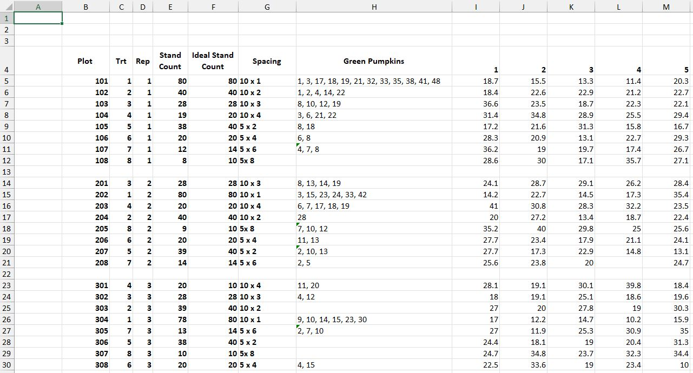
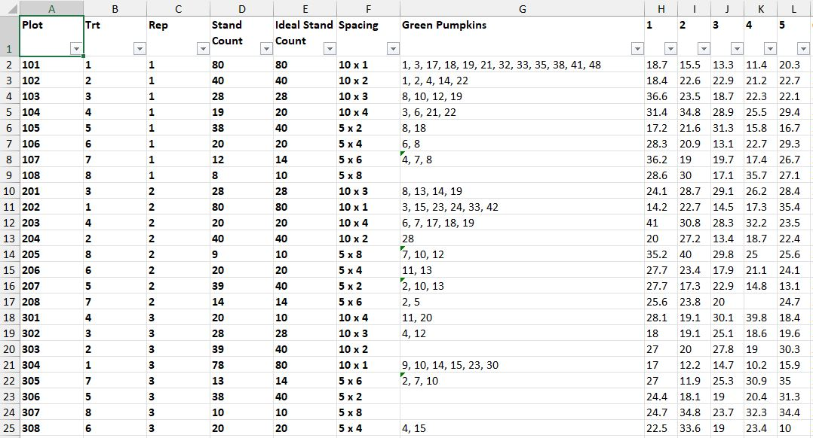

Delivery Phases
================
Last Update: 2/13/2022


# Discovery

As a graduate level course offering at North Carolina State University,
*ST542 - Statistical Practice* provides a discussion-based introduction
to statistical practice that is geared towards students in the final
semester of their Master of Statistics degree. Students practice writing
and presenting throughout the semester, gaining soft skills that aren’t
necessarily covered in other statistical courses. Students are paired
and assigned to consulting engagements provided by the instructor that
are selected from a list of projects submitted by researchers on campus.
Covered topics of the course include negotiating expectations with
clients, technical writing and editing, data cleaning and visualization,
and finding research ideas from consulting projects.

## Participants

**Client:** Kim Heagy *(NCSU Horticulture Grad Student)*  
**Consultants:** Brian Sugg, Chengxi Zou *(NCSU Statistics Grad
Students)*

## Project Background

Pumpkins are an emerging specialty crop in North Carolina. In 2019 the
state produced 713,000 cwt of pumpkins on 3,000 acres, ranking 6th in
the United States where overall national production is steadily
increasing. With the rise in pumpkin production there is an increasing
need for providing clear guidelines to North Carolina farmers on how
plant density impacts overall production. In the absence of clear
guidelines, North Carolina Extension Agents have noticed a variety of
methods in how farmers grow pumpkins. There is a challenge in not only
determining how to optimize land usage, but also in how to optimize the
capacity of transportation bins for moving pumpkins to market. Another
challenge facing farmers is the rise in commodity prices for fertilizer,
the primary means for applying nitrogen to crops.

Taking into consideration these challenges, it has become necessary to
provide advice to farmers on how growing conditions affect the yield of
pumpkin crops. As part of her thesis for her graduate program at NC
State, Kim Heagy has focused her research in two areas on how to grow
pumpkins most efficiently:

1.  Researching plant density by conducting a plant spacing study, where
    the hypothesis is pumpkins grown closer together will have a higher
    overall yield.  
2.  Researching fertilizer application levels by conducting a separate
    nitrogen study, where the hypothesis is higher leaf nitrogen
    composition will indicate higher yields.

The two studies were conducted at the NC State Extension Upper Mountain
Research Station under the care of North Carolina Extension Agents.

# Data Processing

Raw data from the research conducted in 2020 and 2021 was provided in
multiple Excel files. An inventory is outlined below of the source files
that were received:

  - `2020 Pumpkin Results for Joy.xlsx`
      - 2020 Spacing Study  
  - `2020 stand count.xlsx`
      - 2020 Spacing Study Stand Counts  
  - `2021 Pumpkin Trial Data.xlsx`
      - 2021 Spacing Study  
      - 2021 Nitrogen Study  
      - 2021 Leaf Composition Study  
  - `2021 Bin Pumpkin Sizes.xlsx`
      - 2021 Bin Capacity Study

## Data Formatting

Each of the provided files required formatting in Excel prior to
importing into R. A full step-by-step overview of the changes made
within each Excel workbook is outlined further below. Generally
speaking, the formatting effort focused on getting the worksheets into a
table form. This included tasks such as removing unnecessary blank rows
and columns, ensuring categorical values were consistently spelled and
spaced (“10 x 1” rather than “10x 1”), along with other minor changes to
assist with a clean import to R.

### 2020 Pumpkin Results for Joy.xlsx

This file contained the 2020 spacing study data, consisting of three
worksheets total, with one worksheet for each of the three metrics that
were recorded during the harvest (weight, length, diameter). The
worksheet inventory included:

  - `Spacing Weight`  
  - `Spacing Length`  
  - `Spacing Diameter`

The below formatting steps were followed for each of the three
worksheets:

1.  Removed empty rows and empty columns from the top and the left of
    the main data frame
      - Resulted in all column names moving up to row 1  
2.  Removed empty rows between records that were separating `reps`  
3.  Inserted 1 column at column D position as `Spacing` to hold a
    concatenation of the `Row Distance` and `In Row Distance` columns,
    to match the same presentation of the `Spacing` variable in the 2021
    data
      - Formula = `CONCATENATE($E2," x ",$F2)` and apply down entire
        column  
4.  Copied the new `Spacing` column D and pasted back as values only to
    remove formula dependence on `Row Distance` and `In Row Distance`  
5.  Deleted the `Row Distance` and `In Row Distance` columns after
    concatenation  
6.  Checked `Green Fruit` column E to ensure all values were evenly
    spaced by “,” (“comma space”) for parsing during the import
    process  
7.  Repeated the above steps 1 - 6 for the other two worksheets

Finally, the file was renamed to `2020pumpkinData.xlsx` after formatting
for easy future reference.

#### Preview Before Formatting

<div class="figure">


<p class="caption">

2020 Pumpkin Results for Joy.xlsx

</p>

</div>

#### Preview After Formatting

<div class="figure">


<p class="caption">

2020pumpkinData.xlsx

</p>

</div>

### 2020 stand count.xlsx

This file contained the stand count data from the 2020 spacing study,
which was not part of the original file `2020 Pumpkin Results for
Joy.xlsx`. The worksheet inventory included:

  - `Sheet1`

The below formatting steps were followed:

1.  Removed empty rows and empty columns from the top and the left of
    the main data frame
      - Resulted in all column names moving up to row 1

Finally, the file was renamed to `2020standCount.xlsx` after formatting
for easy future reference.

### 2021 Pumpkin Trial Data.xlsx

This file contained the 2021 spacing study, nitrogen study, and leaf
composition study data, consisting of nine worksheets total, with one
worksheet for each of the three metrics that were recorded during the
harvest (weight, length, diameter) for each of the three studies. The
worksheet inventory included:

  - `Spacing Weights (lbs)`  
  - `Spacing Lengths (inches)`  
  - `Spacing Diameters (inches)`  
  - `Nitrogen Weights (lbs)`  
  - `Nitrogen Lengths (inches)`  
  - `Nitrogen Diameters (inches)`  
  - `Leaf Analysis Nitrogen (%)`  
  - `Leaf Analysis Phosphorus (%)`  
  - `Leaf Analysis Potassium (%)`

#### Spacing Study

The below formatting steps were followed for each of the three
worksheets for the spacing study:

1.  Removed empty rows and empty columns from the top and the left of
    the main data frame
      - Resulted in all column names moving up to row 1  
2.  Removed empty rows between records that were separating `reps`  
3.  Checked `Spacing` column F to ensure all values were evenly spaced
    for consistent categorical values
      - Example: Adjusted `5x 8` to `5 x 8`  
4.  Checked `Green Fruit` column G to ensure all values were evenly
    spaced by “,” (“comma space”) for parsing during the import
    process  
5.  Repeated the above steps 1 - 4 for the other two spacing study
    worksheets

#### Nitrogen Study

To be processed…

#### Leaf Composition Study

To be processed…

Finally, the file was renamed to `2021pumpkinData.xlsx` after formatting
for easy future reference.

#### Preview Before Formatting

<div class="figure">



<p class="caption">

2021 Pumpkin Trial Data.xlsx

</p>

</div>

#### Preview After Formatting

<div class="figure">



<p class="caption">

2021pumpkinData.xlsx

</p>

</div>

### 2021 Bin Pumpkin Sizes.xlsx

To be processed…

## Data Import

### Spacing Study

#### 2020 Data

Check workbook names and worksheet names for each of the 3 read\_excel
functions.  
Check columns to gather and ensure in Excel the columns with metrics are
6 to 53.  
Adjust both the year and pumpkin ID variables to reflect year 2020.

``` r
# Read sheet with WEIGHTS, transform from wide to tall, remove NA
# records
spacingWeight <- read_excel(path = "2020pumpkinData.xlsx", sheet = "Spacing Weight")
spacingWeight <- gather(spacingWeight, key = "Pumpkin", value = "Weight", 
    6:53)
spacingWeight <- subset(spacingWeight, !is.na(Weight))
# Rename columns
names(spacingWeight) <- c("plot", "treatment", "rep", "spacingDim", "greenPumpkins", 
    "pumpkinNum", "weight")
# Create unique identifier for each pumpkin
spacingWeight <- mutate(spacingWeight, year = "2020")
spacingWeight <- mutate(spacingWeight, pumpkinID = paste0(year, "-", "S", 
    "-", plot, "-", pumpkinNum))

# Read sheet with LENGTHS, transform from wide to tall, remove NA
# records
spacingLength <- read_excel(path = "2020pumpkinData.xlsx", sheet = "Spacing Length")
spacingLength <- gather(spacingLength, key = "Pumpkin", value = "Length", 
    6:52)
spacingLength <- subset(spacingLength, !is.na(Length))
# Rename columns
names(spacingLength) <- c("plot", "treatment", "rep", "spacingDim", "greenPumpkins", 
    "pumpkinNum", "length")
# Create unique identifier for each pumpkin and assign crop year
spacingLength <- mutate(spacingLength, year = "2020")
spacingLength <- mutate(spacingLength, pumpkinID = paste0(year, "-", "S", 
    "-", plot, "-", pumpkinNum))

# Read sheet with DIAMETERS, transform from wide to tall, remove NA
# records
spacingDiameter <- read_excel(path = "2020pumpkinData.xlsx", sheet = "Spacing Diameter")
spacingDiameter <- gather(spacingDiameter, key = "Pumpkin", value = "Diameter", 
    6:52)
spacingDiameter <- subset(spacingDiameter, !is.na(Diameter))
# Rename columns
names(spacingDiameter) <- c("plot", "treatment", "rep", "spacingDim", "greenPumpkins", 
    "pumpkinNum", "diameter")
# Create unique identifier for each pumpkin and assign crop year
spacingDiameter <- mutate(spacingDiameter, year = "2020")
spacingDiameter <- mutate(spacingDiameter, pumpkinID = paste0(year, "-", 
    "S", "-", plot, "-", pumpkinNum))

# Join all spacing metrics in one raw table for quality checks
spacingDataRaw2020 <- inner_join(spacingWeight, spacingLength)
```

    ## Joining, by = c("plot", "treatment", "rep", "spacingDim", "greenPumpkins", "pumpkinNum", "year", "pumpkinID")

``` r
spacingDataRaw2020 <- inner_join(spacingDataRaw2020, spacingDiameter)
```

    ## Joining, by = c("plot", "treatment", "rep", "spacingDim", "greenPumpkins", "pumpkinNum", "year", "pumpkinID")

``` r
# Read sheet with stand count data
spacingStand <- read_excel(path = "2020standCount.xlsx", sheet = "Sheet1")
# Rename columns
names(spacingStand) <- c("treatment", "spacingDim", "plot", "standCountIdeal", 
    "standCount")
# Remove measurement abbreviation for feet (')
spacingStand$spacingDim <- str_remove_all(spacingStand$spacingDim, "'")

# Join stand counts to spacing metrics
spacingDataRaw2020 <- left_join(spacingDataRaw2020, spacingStand)
```

    ## Joining, by = c("plot", "treatment", "spacingDim")

``` r
# Arrange columns for presentation of final table for spacing data
spacingDataRaw2020 <- select(spacingDataRaw2020, c(1, 2, 3, 13, 12, 4, 
    5, 6, 7, 8, 9, 10, 11))

# Create clean table for further transformations
spacingData2020 <- as_tibble(spacingDataRaw2020)

# Remove bad pumpkins ... NEED TO CONFIRM WITH CLIENT
spacingData2020 <- subset(spacingData2020, weight != "rotten")
```

#### 2021 Data

Check workbook names and worksheet names for each of the 3 read\_excel
functions.

``` r
# Read sheet with WEIGHTS, transform from wide to tall, remove NA
# records
spacingWeight <- read_excel(path = "2021pumpkinData.xlsx", sheet = "Spacing Weights (lbs)")
spacingWeight <- gather(spacingWeight, key = "Pumpkin", value = "Weight", 
    8:55)
spacingWeight <- subset(spacingWeight, !is.na(Weight))
# Rename columns
names(spacingWeight) <- c("plot", "treatment", "rep", "standCount", "standCountIdeal", 
    "spacingDim", "greenPumpkins", "pumpkinNum", "weight")
# Create unique identifier for each pumpkin
spacingWeight <- mutate(spacingWeight, year = "2021")
spacingWeight <- mutate(spacingWeight, pumpkinID = paste0(year, "-", "S", 
    "-", plot, "-", pumpkinNum))

# Read sheet with LENGTHS, transform from wide to tall, remove NA
# records
spacingLength <- read_excel(path = "2021pumpkinData.xlsx", sheet = "Spacing Lengths (inches)")
spacingLength <- gather(spacingLength, key = "Pumpkin", value = "Length", 
    8:55)
spacingLength <- subset(spacingLength, !is.na(Length))
# Rename columns
names(spacingLength) <- c("plot", "treatment", "rep", "standCount", "standCountIdeal", 
    "spacingDim", "greenPumpkins", "pumpkinNum", "length")
# Create unique identifier for each pumpkin and assign crop year
spacingLength <- mutate(spacingLength, year = "2021")
spacingLength <- mutate(spacingLength, pumpkinID = paste0(year, "-", "S", 
    "-", plot, "-", pumpkinNum))

# Read sheet with DIAMETERS, transform from wide to tall, remove NA
# records
spacingDiameter <- read_excel(path = "2021pumpkinData.xlsx", sheet = "Spacing Diameters (inches)")
spacingDiameter <- gather(spacingDiameter, key = "Pumpkin", value = "Diameter", 
    8:55)
spacingDiameter <- subset(spacingDiameter, !is.na(Diameter))
# Rename columns
names(spacingDiameter) <- c("plot", "treatment", "rep", "standCount", "standCountIdeal", 
    "spacingDim", "greenPumpkins", "pumpkinNum", "diameter")
# Create unique identifier for each pumpkin and assign crop year
spacingDiameter <- mutate(spacingDiameter, year = "2021")
spacingDiameter <- mutate(spacingDiameter, pumpkinID = paste0(year, "-", 
    "S", "-", plot, "-", pumpkinNum))

# Join all spacing metrics in one raw table for quality checks
spacingDataRaw2021 <- inner_join(spacingWeight, spacingLength)
```

    ## Joining, by = c("plot", "treatment", "rep", "standCount", "standCountIdeal", "spacingDim", "greenPumpkins", "pumpkinNum", "year", "pumpkinID")

``` r
spacingDataRaw2021 <- inner_join(spacingDataRaw2021, spacingDiameter)
```

    ## Joining, by = c("plot", "treatment", "rep", "standCount", "standCountIdeal", "spacingDim", "greenPumpkins", "pumpkinNum", "year", "pumpkinID")

``` r
# Create clean table for further transformations
spacingData2021 <- as_tibble(spacingDataRaw2021)
```

## Data Transformation

``` r
# Stack the 2020 and 2021 data sets into one tibble
spacingData <- rbind(spacingData2020, spacingData2021)

# Format variables
spacingData$plot <- as.factor(spacingData$plot)
spacingData$treatment <- as.factor(spacingData$treatment)
spacingData$rep <- as.factor(spacingData$rep)
spacingData$pumpkinNum <- as.numeric(spacingData$pumpkinNum)
spacingData$year <- as.factor(spacingData$year)

# Create variable for pumpkin color, populate based on conditional
# statement, and format
spacingData <- mutate(spacingData, color = "unknown")
for (i in 1:nrow(spacingData)) {
    spacingData[i, 14] <- if_else(spacingData[i, 8] %in% sapply(strsplit(as.character(spacingData[i, 
        7]), split = ", "), function(x) as.numeric(x)), "Green", "Orange")
}
spacingData$color <- as.factor(spacingData$color)

# Create variable for spacing area and transform spacing variables
# factors
spacingData <- mutate(spacingData, spacingArea = sapply(strsplit(as.character(spacingDim), 
    split = " x "), function(x) prod(as.numeric(x))))
spacingData$spacingArea <- as.factor(spacingData$spacingArea)
spacingData$spacingDim <- as.character(spacingData$spacingDim)
spacingData$length <- as.numeric(spacingData$length)

# Create variable for realized ideal stand count percentage
spacingData <- mutate(spacingData, standCountIdealPct = standCount/standCountIdeal)

# Create variable for volume spacingData <-
# mutate(spacingData,volumeSphere=(4/3)*pi*(diameter/2)^3)
spacingData <- mutate(spacingData, volumeEllipsoid = (4/3) * pi * (diameter/2) * 
    (diameter/2) * (length/2))

# Arrange columns for presentation of final table for spacing data
spacingData <- select(spacingData, c(11, 10, 1, 3, 2, 8, 15, 6, 4, 5, 16, 
    14, 9, 12, 13, 17))

# Split spacingDim for betweenRow and inRow columns
spacingData <- separate(spacingData, spacingDim, into = c("betweenRow", 
    "inRow"), sep = " x ", remove = FALSE)
spacingData$spacingDim <- as.factor(spacingData$spacingDim)
spacingData$betweenRow <- as.factor(spacingData$betweenRow)
spacingData$inRow <- as.factor(spacingData$inRow)

# Provide structure of transformed variables with data preview
str(spacingData)
```

    ## tibble [1,259 x 18] (S3: tbl_df/tbl/data.frame)
    ##  $ pumpkinID         : chr [1:1259] "2020-S-101-1" "2020-S-102-1" "2020-S-103-1" "2020-S-104-1" ...
    ##  $ year              : Factor w/ 2 levels "2020","2021": 1 1 1 1 1 1 1 1 1 1 ...
    ##  $ plot              : Factor w/ 32 levels "101","102","103",..: 1 2 3 4 5 6 7 8 9 10 ...
    ##  $ rep               : Factor w/ 4 levels "1","2","3","4": 1 1 1 1 1 1 1 1 2 2 ...
    ##  $ treatment         : Factor w/ 8 levels "1","2","3","4",..: 1 2 3 4 5 6 7 8 3 1 ...
    ##  $ pumpkinNum        : num [1:1259] 1 1 1 1 1 1 1 1 1 1 ...
    ##  $ spacingArea       : Factor w/ 4 levels "10","20","30",..: 1 2 3 4 1 2 3 4 3 1 ...
    ##  $ spacingDim        : Factor w/ 8 levels "10 x 1","10 x 2",..: 1 2 3 4 5 6 7 8 3 1 ...
    ##  $ betweenRow        : Factor w/ 2 levels "10","5": 1 1 1 1 2 2 2 2 1 1 ...
    ##  $ inRow             : Factor w/ 6 levels "1","2","3","4",..: 1 2 3 4 2 4 5 6 3 1 ...
    ##  $ standCount        : num [1:1259] 79 40 28 20 40 20 14 10 28 80 ...
    ##  $ standCountIdeal   : num [1:1259] 80 40 28 20 40 20 14 10 28 80 ...
    ##  $ standCountIdealPct: num [1:1259] 0.988 1 1 1 1 ...
    ##  $ color             : Factor w/ 2 levels "Green","Orange": 1 1 2 1 1 2 2 2 2 2 ...
    ##  $ weight            : chr [1:1259] "17" "9.8" "40.7" "37" ...
    ##  $ length            : num [1:1259] 11.1 9.3 16.1 13.5 11.5 11.4 12.7 12.9 12.3 10.1 ...
    ##  $ diameter          : num [1:1259] 11.3 10.1 15.8 15.2 12.3 12.6 13.5 14.3 13.1 10.1 ...
    ##  $ volumeEllipsoid   : num [1:1259] 742 497 2104 1633 911 ...

``` r
spacingData
```

    ## # A tibble: 1,259 x 18
    ##    pumpkinID year  plot  rep   treatment pumpkinNum spacingArea spacingDim
    ##    <chr>     <fct> <fct> <fct> <fct>          <dbl> <fct>       <fct>     
    ##  1 2020-S-1~ 2020  101   1     1                  1 10          10 x 1    
    ##  2 2020-S-1~ 2020  102   1     2                  1 20          10 x 2    
    ##  3 2020-S-1~ 2020  103   1     3                  1 30          10 x 3    
    ##  4 2020-S-1~ 2020  104   1     4                  1 40          10 x 4    
    ##  5 2020-S-1~ 2020  105   1     5                  1 10          5 x 2     
    ##  6 2020-S-1~ 2020  106   1     6                  1 20          5 x 4     
    ##  7 2020-S-1~ 2020  107   1     7                  1 30          5 x 6     
    ##  8 2020-S-1~ 2020  108   1     8                  1 40          5 x 8     
    ##  9 2020-S-2~ 2020  201   2     3                  1 30          10 x 3    
    ## 10 2020-S-2~ 2020  202   2     1                  1 10          10 x 1    
    ## # ... with 1,249 more rows, and 10 more variables: betweenRow <fct>,
    ## #   inRow <fct>, standCount <dbl>, standCountIdeal <dbl>,
    ## #   standCountIdealPct <dbl>, color <fct>, weight <chr>, length <dbl>,
    ## #   diameter <dbl>, volumeEllipsoid <dbl>

``` r
# Export R data object to Excel for client review
write_xlsx(spacingData, "spacingData.xlsx")
```

# Data Exploration

## Plots and Charts

### Spacing Study

``` r
# Scatter plot of weight vs length
plot(spacingData$length, spacingData$weight, xlab = "Length (in)", ylab = "Weight (lbs)")
```

<!-- -->

``` r
# Scatter plot of weight vs diameter
plot(spacingData$diameter, spacingData$weight, xlab = "Diameter (in)", 
    ylab = "Weight (lbs)")
```

<!-- -->

``` r
# Scatter plot of diameter vs length
plot(spacingData$length, spacingData$diameter, xlab = "Length (in)", ylab = "Diameter (in)")
```

<!-- -->

``` r
# Boxplot by spacing dimension ggplot(spacingData, aes(x=spacingDim,
# y=weight, fill=spacingDim)) + geom_boxplot(varwidth = TRUE,
# alpha=0.2) + theme(legend.position='none')

# Boxplot by spacing area ggplot(spacingData, aes(x=spacingArea,
# y=weight, fill=spacingArea)) + geom_boxplot(varwidth = TRUE,
# alpha=0.2) + theme(legend.position='none')
```

# Analysis

# Conclusions

include = FALSE prevents code and results from appearing in the finished
file. R Markdown still runs the code in the chunk  
echo = FALSE prevents code, but not the results from appearing in the
finished file. This is a useful way to embed figures  
message = FALSE prevents messages that are generated by code from
appearing in the finished file  
warning = FALSE prevents warnings that are generated by code from
appearing in the finished  
fig.cap = “…” adds a caption to graphical results
