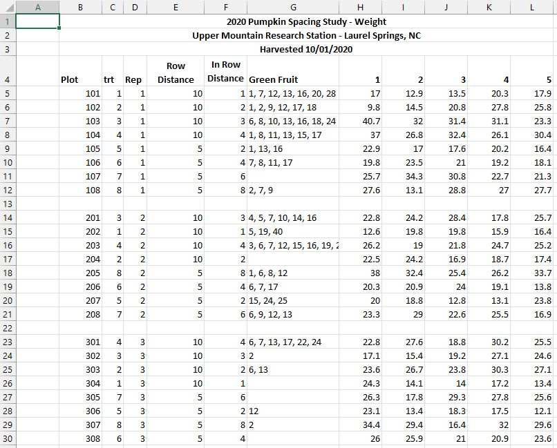

```{r setup, include=FALSE}
library(tidyverse)
library(formatR)
library(dplyr)
library(readxl)
library(ggplot2)
library(writexl)
knitr::opts_chunk$set(echo=TRUE,tidy.opts=list(width.cutoff=70),tidy=TRUE)
```

# Discovery  

Placeholder for project introduction.  

# Data Processing  

Raw data from the research conducted in 2020 and 2021 was provided in multiple Excel files. An inventory is outlined below of the source files that were received:  

* `2020 Pumpkin Results for Joy.xlsx`  
    + 2020 Spacing Study  
* `2020 stand count.xlsx`  
    + 2020 Spacing Study Stand Counts  
* `2021 Pumpkin Trial Data.xlsx`  
    + 2021 Spacing Study  
    + 2021 Nitrogen Study  
    + 2021 Leaf Composition Study  
* `2021 Bin Pumpkin Sizes.xlsx`  
    + 2021 Bin Capacity Study  
* `<Placeholder for 2022 Nitrogen Study>`  

## Data Formatting  

Each of the provided files required formatting in Excel prior to importing into R. A full step-by-step overview of the changes made within each Excel workbook is outlined further below. Generally speaking, the formatting effort focused on getting the worksheets into a table form. This included tasks such as removing unnecessary blank rows and columns, ensuring categorical values were consistently spelled and spaced ("10 x 1" rather than "10x 1"), along with other minor changes to assist with a clean import to R.  

### `2020 Pumpkin Results for Joy.xlsx` to `2020pumpkinData.xlsx`  

This file contained the 2020 spacing study data, consisting of three worksheets total, with one worksheet for each of the three metrics that were recorded during the harvest (weight, length, diameter). The worksheet inventory included:  

* `Spacing Weight`  
* `Spacing Length`  
* `Spacing Diameter`  

The below formatting steps were followed for each of the three worksheets:  

1. Removed empty rows and empty columns from the top and the left of the main data frame  
    + Deleted the top 3 rows containing the project header, which moved all column names up to row 1  
2. Removed empty rows between records that were separating `reps`  
3. Inserted 2 columns at column D and column E positions as empty placeholders for `Stand Count` and `Ideal Stand Count` columns, respectively, to match the locations of these columns as found in the 2021 data  
4. Inserted 1 column at column F position as `Spacing` to hold a concatenation of the `Row Distance` and `In Row Distance` columns, to match the same presentation of the `Spacing` variable in the 2021 data  
    + Formula = `CONCATENATE(G2," x ",F2)`  
5. Copied the new `Spacing` column F and pasted back as values only to remove formula dependence on `Row Distance` and `In Row Distance`  
6. Deleted the `Row Distance` and `In Row Distance` columns after concatenation  
7. Checked `Green Fruit` column G to ensure all values were evenly spaced by ", " for parsing in R during the import process  
8. Repeated the above steps 1 - 7 for the other two worksheets  

Finally, the file was renamed to `2020pumpkinData.xlsx` for easy future reference.  

#### Preview Before Formatting  

```{r dataFormat2020spacingBefore, echo=FALSE, out.width="85%"}

```

#### Preview After Formatting  

```{r dataFormat2020spacingAfter, echo=FALSE, out.width="85%"}
knitr::include_graphics("./Images/Files/2020spacingAfter.JPG")
```

### `2020 stand count.xlsx`  

### `2021 Pumpkin Trial Data.xlsx` to `2021pumpkinData.xlsx`  

### `2021 Bin Pumpkin Sizes.xlsx`  

## Data Import  

### Spacing Study  

#### 2020 Data

Check workbook names and worksheet names for each of the 3 read_excel functions.  
Check columns to gather and ensure in Excel the columns with metrics are 8 to 55.  
Adjust both the year and pumpkin ID variables to reflect year 2020.  

```{r readExcel2020spacing}
# Read sheet with WEIGHTS, transform from wide to tall, remove NA records
spacingWeight <- read_excel(path="2020pumpkinData.xlsx", sheet="Spacing Weight")
spacingWeight <- gather(spacingWeight,key="Pumpkin",value="Weight",8:55)
spacingWeight <- subset(spacingWeight,!is.na(Weight))
# Rename columns
names(spacingWeight) <- c("plot","treatment","rep","standCount","standCountIdeal","spacingDim","greenPumpkins","pumpkinNum","weight")
# Create unique identifier for each pumpkin
spacingWeight <- mutate(spacingWeight,year="2020")
spacingWeight <- mutate(spacingWeight,pumpkinID=paste0(year,"-","S","-",plot,"-",pumpkinNum))

# Read sheet with LENGTHS, transform from wide to tall, remove NA records
spacingLength <- read_excel(path="2020pumpkinData.xlsx", sheet="Spacing Length")
spacingLength <- gather(spacingLength,key="Pumpkin",value="Length",8:54)
spacingLength <- subset(spacingLength,!is.na(Length))
# Rename columns
names(spacingLength) <- c("plot","treatment","rep","standCount","standCountIdeal","spacingDim","greenPumpkins","pumpkinNum","length")
# Create unique identifier for each pumpkin and assign crop year
spacingLength <- mutate(spacingLength,year="2020")
spacingLength <- mutate(spacingLength,pumpkinID=paste0(year,"-","S","-",plot,"-",pumpkinNum))

# Read sheet with DIAMETERS, transform from wide to tall, remove NA records
spacingDiameter <- read_excel(path="2020pumpkinData.xlsx", sheet="Spacing Diameter")
spacingDiameter <- gather(spacingDiameter,key="Pumpkin",value="Diameter",8:54)
spacingDiameter <- subset(spacingDiameter,!is.na(Diameter))
# Rename columns
names(spacingDiameter) <- c("plot","treatment","rep","standCount","standCountIdeal","spacingDim","greenPumpkins","pumpkinNum","diameter")
# Create unique identifier for each pumpkin and assign crop year
spacingDiameter <- mutate(spacingDiameter,year="2020")
spacingDiameter <- mutate(spacingDiameter,pumpkinID=paste0(year,"-","S","-",plot,"-",pumpkinNum))

# Join all spacing metrics in one raw table for quality checks
spacingDataRaw2020 <- inner_join(spacingWeight,spacingLength)
spacingDataRaw2020 <- inner_join(spacingDataRaw2020,spacingDiameter)

# Create clean table for further transformations
spacingData2020 <- as_tibble(spacingDataRaw2020)

# Remove bad pumpkins ... NEED TO CONFIRM WITH CLIENT
spacingData2020 <- subset(spacingData2020, weight!="rotten")
```  

#### 2021 Data  

Check workbook names and worksheet names for each of the 3 read_excel functions.  

```{r readExcel2021spacing}
# Read sheet with WEIGHTS, transform from wide to tall, remove NA records
spacingWeight <- read_excel(path="2021pumpkinData.xlsx", sheet="Spacing Weights (lbs)")
spacingWeight <- gather(spacingWeight,key="Pumpkin",value="Weight",8:55)
spacingWeight <- subset(spacingWeight,!is.na(Weight))
# Rename columns
names(spacingWeight) <- c("plot","treatment","rep","standCount","standCountIdeal","spacingDim","greenPumpkins","pumpkinNum","weight")
# Create unique identifier for each pumpkin
spacingWeight <- mutate(spacingWeight,year="2021")
spacingWeight <- mutate(spacingWeight,pumpkinID=paste0(year,"-","S","-",plot,"-",pumpkinNum))

# Read sheet with LENGTHS, transform from wide to tall, remove NA records
spacingLength <- read_excel(path="2021pumpkinData.xlsx", sheet="Spacing Lengths (inches)")
spacingLength <- gather(spacingLength,key="Pumpkin",value="Length",8:55)
spacingLength <- subset(spacingLength,!is.na(Length))
# Rename columns
names(spacingLength) <- c("plot","treatment","rep","standCount","standCountIdeal","spacingDim","greenPumpkins","pumpkinNum","length")
# Create unique identifier for each pumpkin and assign crop year
spacingLength <- mutate(spacingLength,year="2021")
spacingLength <- mutate(spacingLength,pumpkinID=paste0(year,"-","S","-",plot,"-",pumpkinNum))

# Read sheet with DIAMETERS, transform from wide to tall, remove NA records
spacingDiameter <- read_excel(path="2021pumpkinData.xlsx", sheet="Spacing Diameters (inches)")
spacingDiameter <- gather(spacingDiameter,key="Pumpkin",value="Diameter",8:55)
spacingDiameter <- subset(spacingDiameter,!is.na(Diameter))
# Rename columns
names(spacingDiameter) <- c("plot","treatment","rep","standCount","standCountIdeal","spacingDim","greenPumpkins","pumpkinNum","diameter")
# Create unique identifier for each pumpkin and assign crop year
spacingDiameter <- mutate(spacingDiameter,year="2021")
spacingDiameter <- mutate(spacingDiameter,pumpkinID=paste0(year,"-","S","-",plot,"-",pumpkinNum))

# Join all spacing metrics in one raw table for quality checks
spacingDataRaw2021 <- inner_join(spacingWeight,spacingLength)
spacingDataRaw2021 <- inner_join(spacingDataRaw2021,spacingDiameter)

# Create clean table for further transformations
spacingData2021 <- as_tibble(spacingDataRaw2021)
```  

## Data Transformation  

```{r transformSpacingData}
# Stack the 2020 and 2021 data sets into one tibble
spacingData <- rbind(spacingData2020,spacingData2021)

# Format variables
spacingData$plot <- as.factor(spacingData$plot)
spacingData$treatment <- as.factor(spacingData$treatment)
spacingData$rep <- as.factor(spacingData$rep)
spacingData$pumpkinNum <- as.numeric(spacingData$pumpkinNum)
spacingData$year <- as.factor(spacingData$year)

# Create variable for pumpkin color, populate based on conditional statement, and format
spacingData <- mutate(spacingData,color="unknown")
for (i in 1:nrow(spacingData)) {
  spacingData[i,14] <- if_else(spacingData[i,8] %in% sapply(strsplit(as.character(spacingData[i,7]),split=", "),function(x) as.numeric(x)),
                                 "Green",
                                 "Orange")
}
spacingData$color <- as.factor(spacingData$color)

# Create variable for spacing area and transform spacing variables factors
spacingData <- mutate(spacingData,spacingArea=sapply(strsplit(as.character(spacingDim),split=" x "),function(x) prod(as.numeric(x))))
spacingData$spacingArea <- as.factor(spacingData$spacingArea)
spacingData$spacingDim <- as.character(spacingData$spacingDim)
spacingData$length <- as.numeric(spacingData$length)

# Create variable for realized ideal stand count percentage
spacingData <- mutate(spacingData,standCountIdealPct=standCount/standCountIdeal)

# Create variable for volume
# spacingData <- mutate(spacingData,volumeSphere=(4/3)*pi*(diameter/2)^3)
spacingData <- mutate(spacingData,volumeEllipsoid=(4/3)*pi*(diameter/2)*(diameter/2)*(length/2))

# Arrange columns for presentation of final table for spacing data
spacingData <- select(spacingData,c(11,10,1,3,2,8,15,6,4,5,16,14,9,12,13,17))

# Split spacingDim for betweenRow and inRow columns
spacingData <- separate(spacingData,spacingDim,into = c("betweenRow","inRow"),sep=" x ",remove=FALSE)
spacingData$spacingDim <- as.factor(spacingData$spacingDim)
spacingData$betweenRow <- as.factor(spacingData$betweenRow)
spacingData$inRow <- as.factor(spacingData$inRow)

# Provide structure of transformed variables with data preview
str(spacingData)
spacingData

# Export R data object to Excel for client review
write_xlsx(spacingData,"spacingData.xlsx")
```

# Data Exploration  

## Plots and Charts  

### Spacing Study  

```{r exploreSpacingData}
# Scatter plot of weight vs length
plot(spacingData$length,spacingData$weight,
     xlab="Length (in)",
     ylab="Weight (lbs)")

# Scatter plot of weight vs diameter
plot(spacingData$diameter,spacingData$weight,
     xlab="Diameter (in)",
     ylab="Weight (lbs)")

# Scatter plot of diameter vs length
plot(spacingData$length,spacingData$diameter,
     xlab="Length (in)",
     ylab="Diameter (in)")

# Boxplot by spacing dimension
#ggplot(spacingData, aes(x=spacingDim, y=weight, fill=spacingDim)) +
#    geom_boxplot(varwidth = TRUE, alpha=0.2) +
#    theme(legend.position="none")

# Boxplot by spacing area
#ggplot(spacingData, aes(x=spacingArea, y=weight, fill=spacingArea)) +
#    geom_boxplot(varwidth = TRUE, alpha=0.2) +
#    theme(legend.position="none")
```

# Analysis  

# Conclusions  

include = FALSE prevents code and results from appearing in the finished file. R Markdown still runs the code in the chunk  
echo = FALSE prevents code, but not the results from appearing in the finished file. This is a useful way to embed figures  
message = FALSE prevents messages that are generated by code from appearing in the finished file  
warning = FALSE prevents warnings that are generated by code from appearing in the finished  
fig.cap = "..." adds a caption to graphical results  

